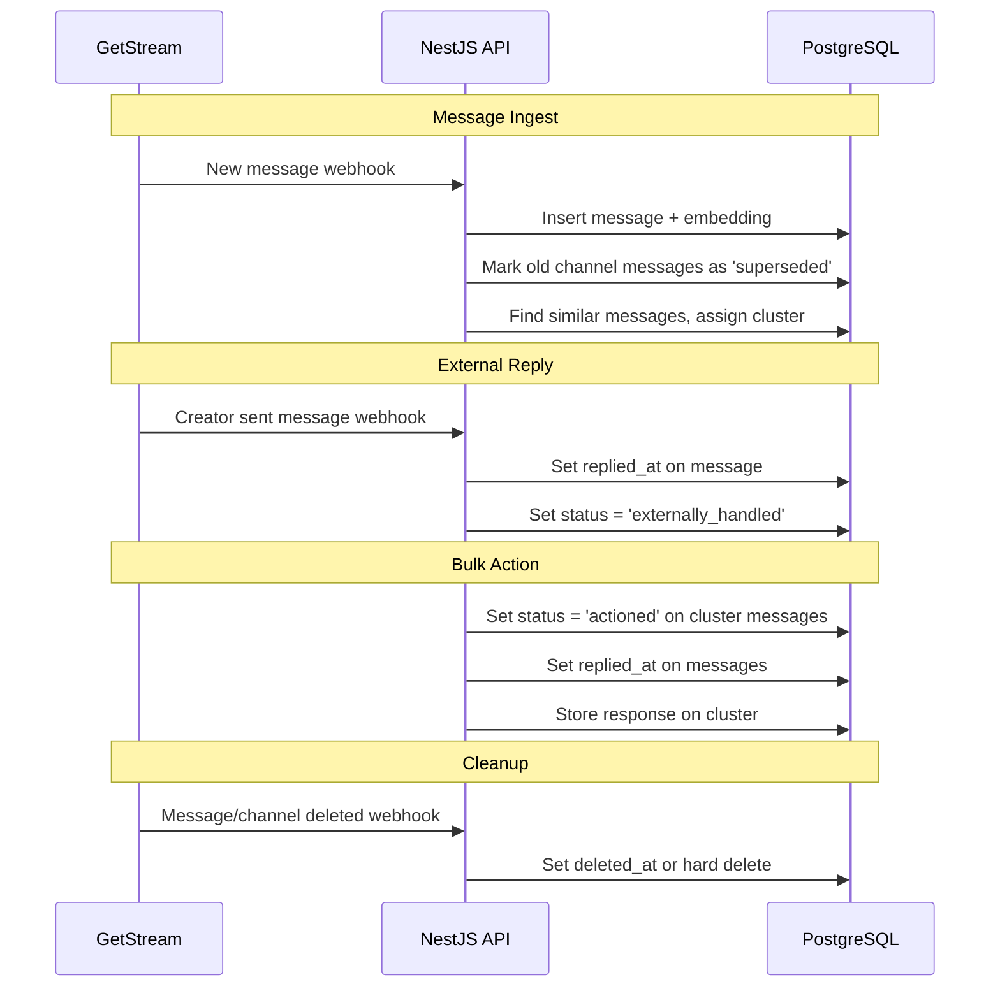

# Cluster Rules & Cleanup Plan

## Current State

- Messages ingested with embeddings, clustered by similarity
- `cluster_messages` join table has `excluded_at` for manual removal
- No handling for: external replies, superseded messages, deleted users/messages

---

## Decision: Message Status Strategy

### Options

| Option                                   | Schema Change       | Pros                                                              | Cons                               |
| ---------------------------------------- | ------------------- | ----------------------------------------------------------------- | ---------------------------------- |
| **1. `excluded_at` only**                | None                | Simple, existing pattern                                          | No context on _why_ excluded       |
| **2. Status enum on `cluster_messages`** | Add `status` column | Preserves reason, audit trail, UI can show "2 handled externally" | More complex queries               |
| **3. Use `replied_at` on message**       | None                | Simplest, single source of truth                                  | No distinction between reply types |

### Recommendation

**Option 2** for production-quality UX. Proposed enum values:

```sql
CREATE TYPE cluster_message_status AS ENUM (
  'active',           -- Default, actionable
  'actioned',         -- Replied via bulk action
  'externally_handled', -- Creator replied outside bulk flow
  'superseded',       -- Newer message from same channel exists
  'removed'           -- Manually removed by creator
);
```

Queries filter by `status = 'active'` for actionable clusters.

---

## Behavioral Rules

### 1. One message per channel per cluster

When a new message arrives from a channel that already has a message in any cluster:

- Mark the old message as `superseded`
- New message can be clustered normally

```sql
UPDATE cluster_messages cm
SET status = 'superseded'
FROM messages m
WHERE cm.message_id = m.id
  AND m.channel_id = $1
  AND m.id <> $2
  AND cm.status = 'active'
```

### 2. External reply handling

When creator replies outside bulk flow (via GetStream directly):

- Call `markChannelReplied(creatorId, channelId)`
- Sets `replied_at` on message
- Sets `status = 'externally_handled'` on cluster_messages

### 3. Bulk action

When creator actions a cluster:

- Sets `status = 'actioned'` on all active messages in cluster
- Sets `replied_at` on messages
- Stores response text on cluster

---

## Cleanup Scenarios

### User Deleted

When a creator account is deleted:

- Delete all their messages from `messages` table (CASCADE handles `cluster_messages`)
- Delete all their clusters from `clusters` table
- Or: soft delete with `deleted_at` if audit trail needed

```sql
-- Hard delete approach
DELETE FROM clusters WHERE creator_id = $1;
DELETE FROM messages WHERE creator_id = $1;
```

### Message Deleted from Stream

When a message is deleted externally (GetStream webhook or sync):

- Option A: Hard delete from our DB
- Option B: Mark with `deleted_at`, exclude from queries

```sql
-- Option A
DELETE FROM messages WHERE external_message_id = $1;

-- Option B
ALTER TABLE messages ADD COLUMN deleted_at timestamptz;
UPDATE messages SET deleted_at = now() WHERE external_message_id = $1;
```

Recommendation: **Option B** for audit trail, but either works for POC.

### Channel Deleted

When a channel is deleted from Stream:

- Mark all messages from that channel as deleted
- Or delete them entirely

```sql
UPDATE messages SET deleted_at = now() WHERE channel_id = $1;
```

### Stale Clusters

Clusters with no active messages should be:

- Auto-closed (set `status = 'Actioned'` or new `'Empty'` status)
- Or cleaned up by background job

```sql
-- Find clusters with no active messages
SELECT c.id
FROM clusters c
WHERE c.status = 'Open'
AND NOT EXISTS (
  SELECT 1 FROM cluster_messages cm
  WHERE cm.cluster_id = c.id AND cm.status = 'active'
);
```

---

## Schema Changes Required

```sql
-- 1. Add status enum to cluster_messages
CREATE TYPE cluster_message_status AS ENUM (
  'active',
  'actioned',
  'externally_handled',
  'superseded',
  'removed'
);

ALTER TABLE cluster_messages
ADD COLUMN status cluster_message_status NOT NULL DEFAULT 'active';

-- 2. Add deleted_at to messages (optional, for soft delete)
ALTER TABLE messages ADD COLUMN deleted_at timestamptz;

-- 3. Add summary fields to clusters
ALTER TABLE clusters ADD COLUMN summary_label text;
ALTER TABLE clusters ADD COLUMN summary_description text;
```

---

## API Changes

### New Mutations

```graphql
# Mark channel as replied externally
markChannelReplied(creatorId: ID!, channelId: String!): Boolean!

# Sync deletion from Stream
deleteMessage(externalMessageId: String!): Boolean!

# Cleanup user data
deleteCreatorData(creatorId: ID!): Boolean!
```

### Query Changes

All cluster queries filter by `cm.status = 'active'`:

```sql
SELECT ... FROM cluster_messages cm
WHERE cm.status = 'active'
-- instead of: WHERE cm.excluded_at IS NULL
```

---

## Data Flow



---

## Implementation Order

1. **Schema**: Add `cluster_message_status` enum, migrate `excluded_at` to `status = 'removed'`
2. **Ingest**: Auto-mark superseded messages on new message
3. **External reply**: Add `markChannelReplied` mutation
4. **Cleanup**: Add deletion mutations
5. **Queries**: Update all queries to filter by `status = 'active'`
6. **Summary fields**: Add to cluster model

---

## Notes

- Schema changes require: `docker-compose down -v && docker-compose up --build`
- Consider background job for stale cluster cleanup in production
- Soft delete preferred for audit trail, but hard delete simpler for POC
