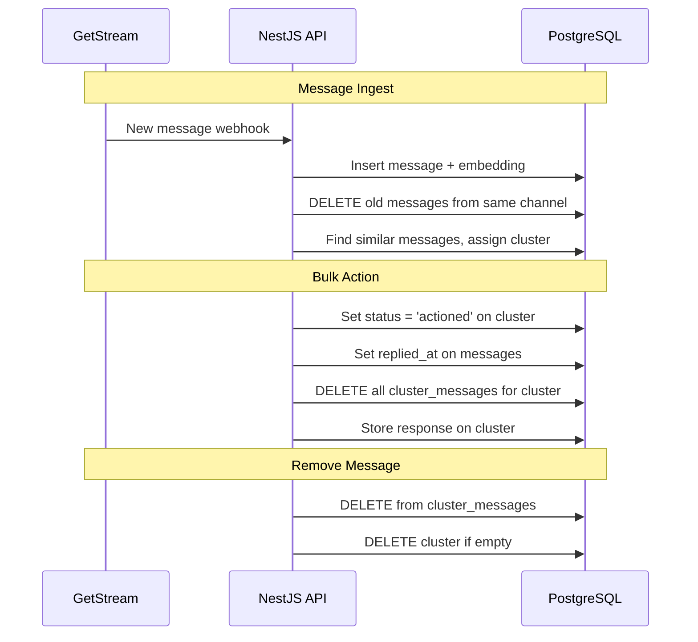

# Cluster Rules & Implementation Summary

## Current State (Implemented)

### Core Features

- ✅ Messages ingested with embeddings, clustered by similarity
- ✅ `cluster_messages` join table (simple many-to-many, no status tracking)
- ✅ `raw_payload jsonb` stores full Stream message (avatars, metadata)
- ✅ Auto-supersede: Only latest message per channel stays in cluster
- ✅ Auto-delete: Empty clusters deleted when last message removed
- ✅ `minChannelCount` filter: Only show clusters with N+ channels

### Optimizations

- ✅ **pg_trgm optimization**: Near-exact duplicates skip embedding API call
  - `TRIGRAM_THRESHOLD = 0.85` - hardcoded constant
  - `SIMILARITY_THRESHOLD = 0.9` - hardcoded constant
  - Only skips embedding when joining a cluster that has other embedded messages
  - `embedding` column is nullable
  - TODO: Move thresholds to feature flag system for production

### Production Integration Notes

- **No-response filter**: Removed from POC
  - In production, integrate with `StreamChatTaggingProcessor` in ltfollowers
  - Use its `needs_reply` classification to gate ingest
  - Avoids duplicating heuristics/LLM calls
- **Paid DMs**: Excluded from clustering (never matched)

---

## Behavioral Rules (Implemented)

### 1. One message per channel per cluster ✅

When a new message arrives from a channel that already has a message in any cluster:

- **DELETE** the old message from `cluster_messages`
- New message can be clustered normally

```sql
-- Implemented in ingestMessage after insert
DELETE FROM cluster_messages cm
USING messages m
WHERE cm.message_id = m.id
  AND m.channel_id = $1
  AND m.creator_id = $2
  AND m.id <> $3  -- not the new message
```

### 2. Auto-delete empty clusters ✅

When `removeClusterMessage` removes the last message:

- **DELETE** the cluster from `clusters` table
- Returns `null` to indicate deletion

```sql
-- Implemented in removeClusterMessage
DELETE FROM clusters
WHERE id = $1
AND NOT EXISTS (
  SELECT 1 FROM cluster_messages WHERE cluster_id = $1
)
```

### 3. Bulk action ✅

When creator actions a cluster:

- Sets `status = 'actioned'` on cluster
- Sets `replied_at` on all messages
- Stores response text on cluster
- **DELETES** all entries from `cluster_messages`

---

## Query Filtering

### Status Filter

- `clusters(status: Open)` - only open clusters
- `clusters(status: Actioned)` - completed clusters

### Channel Count Filter

- `clusters(minChannelCount: 2)` - only clusters with 2+ channels
- Use case: Hide single-message clusters (not worth bulk replying)
- Implemented via SQL `HAVING COUNT(DISTINCT m.channel_id) >= $N`

---

## Not Yet Implemented (Future Work)

### External Reply Handling

When creator replies outside bulk flow (via GetStream directly):

- Add mutation: `markChannelReplied(creatorId, channelId)`
- Sets `replied_at` on message
- Removes message from `cluster_messages`

### Cleanup Scenarios

#### User Deleted

```sql
-- Hard delete approach (CASCADE handles cluster_messages)
DELETE FROM clusters WHERE creator_id = $1;
DELETE FROM messages WHERE creator_id = $1;
```

#### Message Deleted from Stream

Option A: Hard delete

```sql
DELETE FROM messages WHERE external_message_id = $1;
```

Option B: Soft delete (for audit trail)

```sql
ALTER TABLE messages ADD COLUMN deleted_at timestamptz;
UPDATE messages SET deleted_at = now() WHERE external_message_id = $1;
```

#### Channel Deleted

```sql
-- Mark all messages from channel as deleted
UPDATE messages SET deleted_at = now() WHERE channel_id = $1;
-- Or hard delete
DELETE FROM messages WHERE channel_id = $1;
```

### Summary Fields (Nice to Have)

Add to clusters table for AI-generated summaries:

```sql
ALTER TABLE clusters ADD COLUMN summary_label text;
ALTER TABLE clusters ADD COLUMN summary_description text;
```

---

## API Surface (Current)

### Mutations

- ✅ `ingestMessage` - Add message, auto-cluster
- ✅ `actionCluster` - Bulk reply (sets status, response, replied_at)
- ✅ `removeClusterMessage` - Remove one message (auto-deletes cluster if empty)

### Queries

- ✅ `clusters(creatorId, status?, minChannelCount?)` - List with filters
- ✅ `cluster(id)` - Detail view with messages

### Future Mutations

- ⏳ `markChannelReplied(creatorId, channelId)` - External reply handling
- ⏳ `deleteMessage(externalMessageId)` - Sync deletions from Stream
- ⏳ `deleteCreatorData(creatorId)` - Cleanup on account deletion

---

## Data Flow



---

## Testing

E2E tests cover:

- ✅ Message ingestion & clustering
- ✅ Trigram matching (near-exact duplicates)
- ✅ Auto-supersede (one message per channel)
- ✅ Cluster listing with filters (status, minChannelCount)
- ✅ Cluster detail with messages & avatars
- ✅ Remove message from cluster
- ✅ Auto-delete empty clusters
- ✅ Action cluster (bulk reply)
- ✅ Status filtering
- ✅ Paid DM exclusion

Run tests: `npm run test:e2e`

---

## Notes

- DELETE approach chosen over status tracking for simplicity
- Message data stays in `messages` table (with `replied_at` if actioned)
- Only cluster membership (`cluster_messages`) is deleted
- Trade-off: No audit trail on cluster membership, but acceptable for POC
- Schema changes require: `docker-compose down -v && docker-compose up --build`
